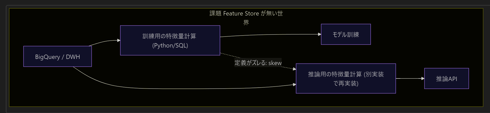
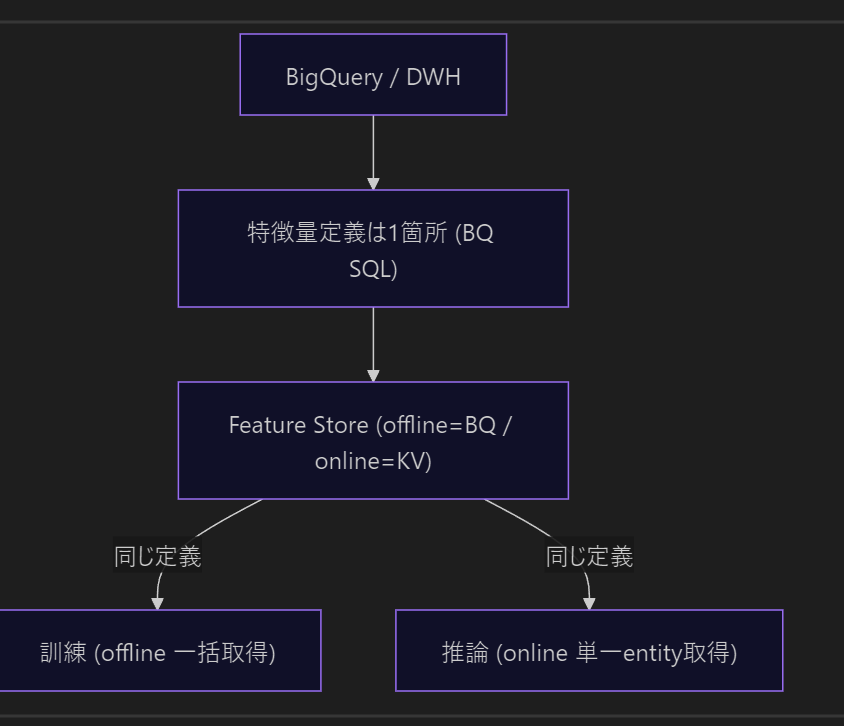
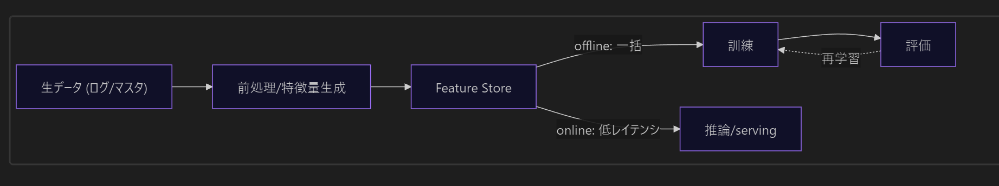
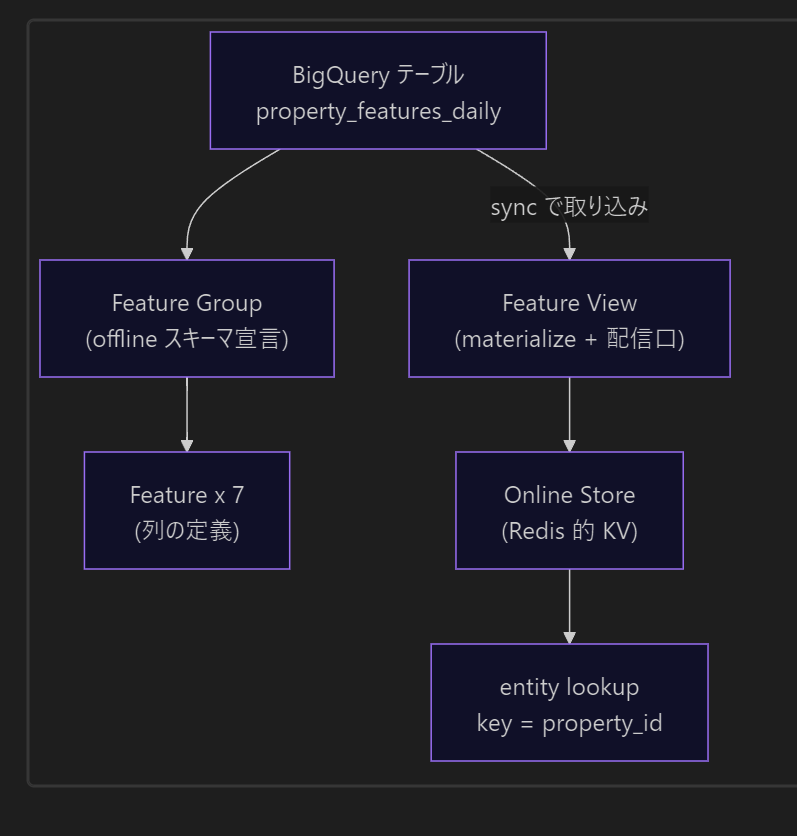
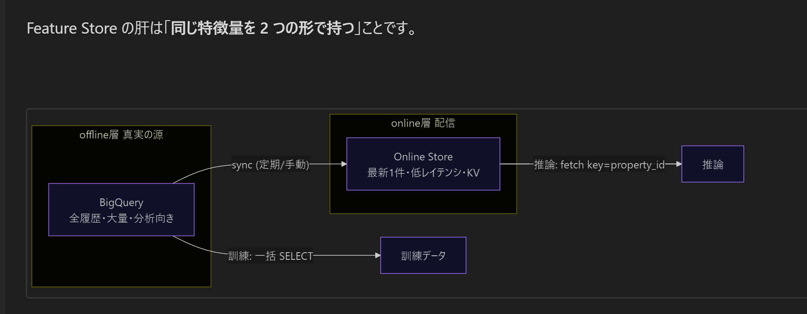

# GCP Vertex AI Feature Store を学ぶプロジェクト

不動産物件のサンプルデータを題材に、BigQuery に蓄積した特徴量を Vertex AI Feature Store に登録し、CLI と GCP コンソール UI の両方から確認・検証する学習用プロジェクト。







## ステータス

**✅ 実装済み + 実 GCP 動作検証済み（2026-05-20 / project `mlops-dev-a` / `asia-northeast1`）**

- 本体（BigQuery → Feature Group / Feature View / Online Store → CLI/UI 検証）: 検証済み
- アドオン1（Feature Store → CSV/GCS 出力、bq / online 両モード）: 検証済み
- アドオン2（BQ raw/master → SQL で特徴量テーブル生成）: 検証済み

IaC は Terraform、実行は Cloud Run jobs。仕様は [docs/01_仕様書.md](docs/01_仕様書.md)、実装の詳細・流用元・検証結果は [docs/02_実装カタログ.md](docs/02_実装カタログ.md)、構築・運用・所要時間は [docs/03_運用.md](docs/03_運用.md)。

## 目的（学習ゴール）

- **BigQuery = 特徴量データの実体・加工場所**（実データ確認の中心）
- **Feature Store = 特徴量の管理・参照・配信レイヤー**
- **Feature Group** = BigQuery 特徴量テーブルを登録する単位
- **Feature View** = オンラインサービング / 同期のための参照単位
- **Online Store** = Feature View の同期先（オンライン配信）

この責務分離を実機で理解する。

## アーキテクチャ

```
[アドオン2] raw dataset (property_master / search_log / pv_log / favorite_log)
      ↓ build-features: BQ SQL (JOIN / 28日集計 / SAFE_DIVIDE 欠損補完 / feature_timestamp)
BigQuery  feature_mart.property_features_daily   (property_id = Entity ID)
      │   ↑ seed (固定5件の quick 路線) も併存
      │   property_features_online_latest (view = 当日スライス)
      ▼
Vertex AI Feature Store
  ├─ Feature Group  property_features    … BQ テーブルを登録 (offline / schema 宣言)
  ├─ Feature × 7                          … 特徴量カラムを Feature 登録
  ├─ Feature View   property_features    … online serving の接続点 (BQ source 直接 materialize)
  └─ Online Store   mlops_dev_feature_store (Optimized) … sync 先
      ▲ sync (REST :sync + finalStatus=OK まで polling)
      │
[アドオン1] export: 特徴量取得 (bq / online) → CSV → GCS → 簡易 downstream 確認
```

## サンプルデータ（採用スキーマ）

`feature_mart.property_features_daily`（Entity ID = `property_id`、参照実装準拠スキーマ）:

| 列 | 型 | 区分 |
|---|---|---|
| `event_date` | DATE | partition |
| `feature_timestamp` | TIMESTAMP | feature-time 列 |
| `property_id` | STRING | **Entity ID** / clustering |
| `rent` | INT64 | Feature |
| `walk_min` | INT64 | Feature |
| `age_years` | INT64 | Feature |
| `area_m2` | FLOAT64 | Feature |
| `ctr` | FLOAT64 | Feature |
| `fav_rate` | FLOAT64 | Feature |
| `inquiry_rate` | FLOAT64 | Feature |
| `popularity_score` | FLOAT64 | フォールバック |

Feature Group に登録する Feature は 7 個（`rent` / `walk_min` / `age_years` / `area_m2` / `ctr` / `fav_rate` / `inquiry_rate`）。

> 注: 初版仕様で例示した列（`area_sqm` / `station_distance_minutes` / `floor` / `has_auto_lock` 等）は、稼働中の参照実装 [study-gcp-search-mlops-gke](../study-gcp-search-mlops-gke/) との整合を優先し、上記スキーマを採用した。

## クイックスタート

```bash
make tf-init
make deploy            # AR apply → image build/push → 残り apply
# --- 本体 (quick 路線) ---
make seed              # 固定5件を property_features_daily へ
make sync              # Feature View sync (⚠ 初回 約19〜21分。下記)
make verify-cli        # bq + Vertex AI REST でリソース確認
# --- アドオン2 (現実路線: raw → SQL 生成) ---
make seed-raw          # raw 4 テーブルへサンプル投入
make build-features    # raw → property_features_daily を SQL 生成
# --- アドオン1 (後段: CSV/GCS 出力) ---
make export            # 特徴量取得 → CSV → GCS (既定 FETCH_SOURCE=bq)
make verify-export     # GCS の出力 CSV を確認
# --- 撤去 ---
make destroy           # 全リソース撤去 (課金停止)
```

合成フロー: `make deploy → seed-raw → build-features → sync → export → verify-export → destroy`

⚠️ **初回 `make sync` は約19〜21分**（Optimized Online Store の serving ノード初期プロビジョニング + 初回 materialize）。2 回目以降は数分。
⚠️ **sync 完了直後は数分間 `fetchFeatureValues` が 404**（伝播遅延）。online 取得は数分おいてから。`app/feature_store/export.py` は 404 を skip する。

## 検証内容（実施済み）

1. **BigQuery**: dataset / 特徴量テーブル / view 作成、サンプル投入、SQL で確認 ✅
2. **Feature Store**: Feature Group（`property_id`=Entity ID）/ Feature×7 / Feature View / Online Store 同期 ✅
3. **CLI 検証**: `bq` + Vertex AI REST（`gcloud ai feature-*` は SDK に無いため REST）/ online `fetchFeatureValues` ✅
4. **GCP UI 検証**: コンソール（Knowledge Catalog で Feature Group スキーマ・Feature・説明）✅

## このプロジェクトで理解すること

- BigQuery は特徴量データの実体・加工場所である
- Feature Store は特徴量の管理・参照・配信レイヤーである
- Feature Group は BigQuery の特徴量テーブルを登録する単位である
- Feature View はオンラインサービングや同期のための参照単位である
- 実データ確認は BigQuery 側が中心である
- Feature Store 側では特徴量の定義・Entity ID・参照経路を管理する

## スコープ外（意図的に採用しない）

学習対象を Feature Store 中核に絞るため、以下は採用しない: Cloud Composer / Dataform / Vector Search / KServe / Elasticsearch / skew monitoring / モデル学習 / Endpoint / 推論API / 外部DB連携。

## ドキュメント

| ファイル | 内容 |
|---|---|
| [docs/01_仕様書.md](docs/01_仕様書.md) | 目的・アーキテクチャ・スキーマ・本体/アドオン仕様・スコープ |
| [docs/02_実装カタログ.md](docs/02_実装カタログ.md) | リソース/コード構成・流用元マッピング・検証結果・設計判断 |
| [docs/03_運用.md](docs/03_運用.md) | コマンド・フロー・所要時間・注意事項・teardown |
| [CLAUDE.md](CLAUDE.md) | Claude Code 向けガイド |
